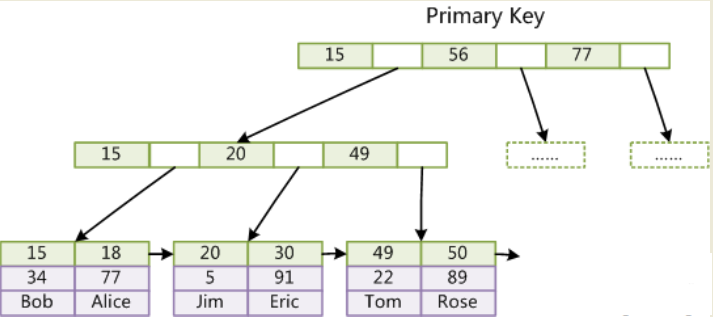
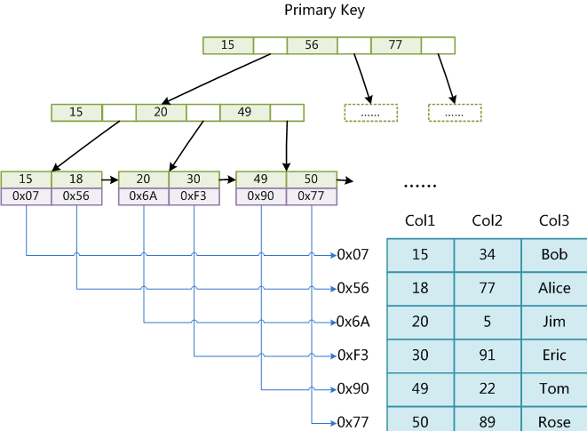

> 抱佛脚一时爽，一直抱佛脚一直爽！这篇文章总结常见的数据库面试问题~因为是抱佛脚，所以结构上没有什么逻辑...
>
> 参考链接：[Waking-Up](https://github.com/wolverinn/Waking-Up)  [CycNotes](https://github.com/CyC2018/CS-Notes)  [牛客网](https://www.nowcoder.com/) [CSDN1](https://blog.csdn.net/du5006150054/article/details/82379210) [CSDN2](https://blog.csdn.net/qq_27607965/article/details/79925288)

[TOC]

# 事务

### ACID属性

- 原子性（Atomicity）：操作要么全部被执行，要么都不执行
- 一致性（Consistency）：数据库在事务执行前后都保持一致性状态。在一致性状态下，所有事务对同一个数据的读取结果都是相同的
- 隔离性（Isolation）：多个事务并发执行时，一个事务的执行不应影响其他事务的执行
- 持久性（Durability）：已被提交的事务对数据库的修改应该永久保存在数据库中，以应对系统崩溃的情况

### 嵌套事务

- 嵌套是子事务套在父事务中执行，子事务是父事务的一部分，在进入子事务之前，父事务建立一个回滚点，叫save point，然后执行子事务，这个子事务的执行也算是父事务的一部分，然后子事务执行结束，父事务继续执行
- 若子事务回滚，则：父事务会回滚到进入子事务前建立的save point，然后尝试其他的事务或者其他的业务逻辑，父事务之前的操作不会受到影响，更不会自动回滚
- 若父事务回滚，则：子事务也会跟着回滚，因为是子事务先提交，父事务再提交

### 并发一致性问题

- 丢失修改：一个事务的更新操作被另外一个事务的更新操作覆盖
- 脏读：T1 修改一个数据但未提交，T2 随后读取这个数据。如果 T1 撤销了这次修改，那么 T2 读取的数据是脏数据
- 不可重复读：T2 读取一个数据，T1 对该数据做了修改。如果 T2 再次读取这个数据，此时读取的结果和第一次读取的结果不同
- 幻读：当同一查询多次执行时，由于其它事务在这个数据范围内执行了插入操作，会导致每次返回不同的结果集（和不可重复读的区别：针对的是一个数据整体/范围；并且需要是插入操作）

### 并发控制

- 加锁
  - 锁的粒度：封锁粒度越小，系统并发性越高，系统开销越大
  - 锁的类型
    - 读写锁
      - 读锁（S锁、共享锁）：加S锁后，可读取、不可更新，其他事务可以加S锁
      - 写锁（X锁、互斥锁）：加X锁后，可进行读取和更新，其他事务不能再加任何锁
    - 意向锁：IX/IS 都是表锁，用来表示一个事务想要在表中的某个数据行上加 X 锁或 S 锁（它们只表示想要对表加锁，而不是真正加锁）
      - 一个事务在获得某个数据行对象的 S 锁之前，必须先获得表的 IS 锁或者更强的锁（强度：IS<S<IX<X）
      - 一个事务在获得某个数据行对象的 X 锁之前，必须先获得表的 IX 锁
      - 通过引入意向锁，事务 T 想要对表 A 加 X 锁，只需要先检测是否有其它事务对表 A 加了 X/IX/S/IS 锁（而不需要一行一行扫是否有行锁），如果加了就表示有其它事务正在使用这个表或者表中某一行的锁，因此事务 T 加 X 锁失败
      - 事务 T1 想要对数据行 R1 加 X 锁，事务 T2 想要对同一个表的数据行 R2 加 X 锁，两个事务都需要对该表加 IX 锁，但是 IX 锁是兼容的，并且 IX 锁与行级的 X 锁也是兼容的，因此两个事务都能加锁成功，对同一个表中的两个数据行做修改
  - 三级封锁协议
    - 一级封锁协议（解决丢失修改问题）：事务 T 要修改数据 A 时必须加 X 锁，直到 T 结束才释放锁
    - 二级封锁协议（解决丢失修改+脏读问题）：一级+要求读取数据 A 时必须加 S 锁，读取完马上释放 S 锁
    - 三级封锁协议（解决丢失修改+脏读+不可重复读问题）：二级+要求读取数据 A 时必须加 S 锁，直到事务结束了才能释放 S 锁
  - 两段锁协议
    - 加锁和解锁分为两个阶段进行
    - 符合两段锁协议的：lock-x(A)...lock-s(B)...lock-s(C)...unlock(A)...unlock(C)...unlock(B)
    - 不符合两段锁协议的：lock-x(A)...unlock(A)...lock-s(B)...unlock(B)...lock-s(C)...unlock(C)
    - 符合两段锁协议是可串行化调度（并发执行的事务结果与以某个顺序串行执行的事务结果相同）的充分不必要条件
  - mysql加锁语句
    - 加S锁：SELECT ... LOCK In SHARE MODE;
    - 加X锁：SELECT ... FOR UPDATE;
- 隔离级别
  - 未提交读：事务中的修改，即使没有提交，对其它事务也是可见的
  - 提交读【可解决脏读问题】：一个事务所做的修改在提交之前对其它事务是不可见的
  - 可重复读【可解决脏读+不可重复读问题】：保证在同一个事务中多次读取同一数据的结果是一样的；MySQL的默认隔离级别
  - 可串行化【可解决脏读+不可重复读+幻读问题】：通过加锁强制事务串行执行，这样多个事务互不干扰，不会出现并发一致性问题

### 传播行为

最常用：PROPAGATION_REQUIRED（如果当前没有事务，就创建一个新事务，如果当前存在事务，就加入该事务）

# 磁盘读取的特性

系统从磁盘读取数据到内存时是以磁盘块（block）为基本单位的，位于同一个磁盘块中的数据会被一次性读取出来

# 索引

### 数据结构基础

- 二叉查找树：左子树的键值小于等于根的键值，右子树的键值大于根的键值

- 平衡二叉树（AVL树）：二叉查找树+任何节点的两个子树的高度最大差为1

- 平衡多路查找树（B树）：所有叶子节点都在同一层

  

- B+树：与B树的主要区别：除主键外的data全部放在叶子节点中，非叶子节点只放主键值信息；所有叶子节点之间都有双向指针

  - 查找过程：
    - 在根节点进行二分查找，找到key对应的指针
    - 递归地在指针所指向的节点进行查找，直到查找到叶子节点
    - 在叶子节点上进行二分查找，找出 key 所对应的 data

  

### B+树相对B树的优势

- 磁盘读写代价更低：所有数据信息全部存储在叶子节点里，这样，整个树的每个节点所占的内存空间就变小了，读到内存中的索引信息就会更多一些，相当于减少了磁盘IO次数
- 查询效率更加稳定：任何关键字的查找必须走一条从根结点到叶子结点的路。所有关键字查询的路径长度相同，导致每一个数据的查询效率相当
- 方便区间查询：B+树的数据都存储在叶子结点中，分支结点均为索引，方便扫库，只需要扫一遍叶子结点即可，但是B树因为其分支结点同样存储着数据，我们要找到具体的数据，需要进行一次中序遍历按序来扫

### B+树相对于红黑树的优势

更低的树高：红黑树出度为2，而B+树出度可以很大

### 索引类型

- 聚簇索引与非聚簇索引
  - 聚簇索引：
    - 叶子节点 data 域记录着完整的数据记录
    - 因为无法把数据行存放在两个不同的地方，所以一个表只能有一个聚簇索引
  - 非聚簇索引：
    - 叶子节点的 data 域记录着主键的值
    - 在使用非聚簇索引进行查找时，需要先查找到主键值，然后再到聚簇索引中进行查找
- 哈希索引
  - 用拉链法解决哈希冲突
  - 哈希索引中只保存哈希值和行指针，不存储字段值
  - 哈希索引数据并非按索引值顺序存储，所以无法用于排序、只支持等值查询
  - 哈希索引不支持部分索引列匹配查找，因为它是对一行的所有列算的哈希值
- 自适应哈希索引（innodb）
  - 当某些索引值被频繁使用时，Innodb会在B+树索引的基础上建立哈希索引
  - 在B+树上用哈希值而不是键本身进行查找
  - 栗子：原本在url这一列上建了B+树索引，url被经常用在where中，所以删除原来url列上的索引，用url的哈希值建立B+树索引
  - 好处：①哈希值体积比url小，省空间；②整数比较比字符串比较快
  - 可以在where语句中指定哈希函数

- 全文索引（myisam）
  - 用于查找文本中的关键词，而不是直接比较是否相等
  - 全文索引使用倒排索引实现，它记录着关键词到其所在文档的映射
  - 查找条件使用 MATCH AGAINST，而不是普通的 WHERE
- 覆盖索引
  - 索引包含了所有满足查询所需要的数据，查询的时候只需要读取索引而不需要回表读取数据

### 索引优化

- 在需要使用多个列作为条件进行查询时，使用多列索引比使用多个单列索引性能更好
- 让选择性最强的索引列放在前面（即SELECT COUNT(DISTINCT staff_id)/COUNT(*)越高放越前面）
- 适当使用覆盖索引（索引包含所有需要查询的字段的值）：索引通常远小于数据行的大小，只读取索引能大大减少数据访问量；一些存储引擎（例如 MyISAM）在内存中只缓存索引，而数据依赖于操作系统来缓存。因此，只访问索引可以不使用系统调用

### 索引的好处

- 大大减少了服务器需要扫描的数据行数
- 帮助服务器避免进行排序和分组，以及避免创建临时表（B+Tree 索引是有序的，可以用于 ORDER BY 和 GROUP BY 操作。临时表主要是在排序和分组过程中创建，不需要排序和分组，也就不需要创建临时表）
- 将随机 I/O 变为顺序 I/O（B+Tree 索引是有序的，会将相邻的数据都存储在一起）

### 索引何时不会被使用

- 如果条件中有or，即使其中有条件带索引也不会使用
- 如果mysql估计使用全表扫描要比使用索引快,则不使用索引（比如重复数据较多的列）
- 查询时，采用is null条件时，不能利用到索引，只能全表扫描（因为索引不存null）
- 前导模糊查询不能利用索引(like '%XX'或者like '%XX%')
- 数据类型出现隐式转化（如varchar不加单引号的话可能会自动转换为int型）

# MySQL

### AUTOCOMMIT

MySQL 默认采用自动提交模式：如果不显式使用START TRANSACTION语句来开始一个事务，那么每个操作都会被当做一个事务并自动提交

### 加锁

​	对select不加锁
​	对增删改加锁
​	支持行级、页级、表级锁

### 如何判断查询是否命中了索引

explain语句（EXPALIN只能解释SELECT操作，其他操作要重写为SELECT后查看执行计划）

### 事务日志

- 存储引擎在修改表数据时，并不是把修改的数据本身持久化到磁盘，而是在内存中修改，并把修改行为记录到持久化到磁盘上了的事务日志中
- 事务日志是追加的方式，因此写日志操作是磁盘一小块区域内的顺序I/O
- 事务日志持久后，内存中被修改的数据会慢慢持久化到磁盘

### MVCC

- 是InnoDB 存储引擎实现隔离级别的一种具体方式，用于实现提交读和可重复读这两种隔离级别（未提交读隔离级别总是读取最新的数据行，要求很低，无需使用 MVCC；可串行化隔离级别需要对所有读取的行都加锁，单纯使用 MVCC 无法实现）
- 基本思想：写操作更新最新的版本快照，而读操作去读旧版本快照，没有互斥关系
- 具体过程
  - 插入操作时，记录创建版本号
  - 删除操作时，记录删除版本号
  - 更新操作时，先记录删除版本号，再新增一行记录创建版本号
  - 查询操作时，要符合以下条件才能被查询出来：删除版本号未定义或大于当前事务版本号（删除操作是在当前事务启动之后做的）；创建版本号小于或等于当前事务版本号（创建操作是事务完成或者在事务启动之前完成）

### InnoDB

- 支持外键约束：FOREIGN KEY(deptId) REFERENCES tb_dept1(id)，则当前表的deptId列中有的值必须在表tb_dept1的id列中存在
- 有行级锁定（若不能确定要扫描的范围，还是需要锁全表）
- 实现了四种隔离级别
- 不支持FULLTEXT类型的索引，且不保存表的行数（所以 select count(*) from table需要扫描全表统计行数）
- 采用两段锁协议，会根据隔离级别在需要的时候自动加锁，并且所有的锁都是在同一时刻被释放，这被称为隐式锁定
- 加锁
  - 意向锁是 InnoDB 自动加的， 不需用户干预
  - 对于 UPDATE、 DELETE 和 INSERT 语句， InnoDB 会自动给涉及数据集加排他锁（X)； 对于普通 SELECT 语句，InnoDB 不会加任何锁
- 磁盘读取
  - InnoDB存储引擎中页是其磁盘管理的最小单位，每次申请磁盘空间时都会是若干地址连续磁盘块来达到页的大小
  - InnoDB在把磁盘数据读入到磁盘时会以页为基本单位
- 间隙锁
  - innodb通过行锁和间隙锁共同组成的next-key lock防止幻读
  - 对前开后闭的区间加锁（假设a b是相邻两行的数据，间隙锁是对(a, b)加锁，行锁是对b加锁，所以next-key lock是对(a,b]加锁）
  - https://www.jianshu.com/p/32904ee07e56

### MyISAM

- mysql默认的引擎
- 支持全文索引
- 支持表级锁

### InnoDB vs MyISAM

- 事务：InnoDB 是事务型的，可以使用 Commit 和 Rollback 语句

- 并发：MyISAM 只支持表级锁，而 InnoDB 还支持行级锁；InnoDB支持MVCC版本控制

- 外键：InnoDB 支持外键

- 备份：InnoDB 支持在线热备份（备份时数据库仍可用）

- 并发：InnoDB 读写阻塞与事务隔离级别相关；MyISAM读写互相阻塞：不仅会在写入的时候阻塞读取，MyISAM还会在读取的时候阻塞写入，但读本身并不会阻塞另外的读

- 存储：

  - InnoDB【索引和数据在一块】：表空间数据文件（由数据段和索引段组成，数据段即为B+树上的叶子节点；索引段就是B+树上的非叶子节点）和它的日志文件
  - MyISAM【索引和数据分开】：表保存为文件的形式（所以在跨平台的数据转移中使用MyISAM存储会省去不少的麻烦）： .frm文件存储表定义，数据文件的扩展名为.MYD，索引文件的扩展名是.MYI
  - MyISAM 支持压缩表和空间数据索引，InnoDB需要更多的内存和存储

- 索引：

  - InnoDB：

    - 主索引（主键上的索引）：聚簇索引；因为InnoDB的数据文件本身要按主键聚集，所以InnoDB要求表必须有主键（MyISAM可以没有），如果没有显式指定，则MySQL系统会自动选择一个可以唯一标识数据记录的列作为主键，如果不存在这种列，则MySQL自动为InnoDB表生成一个隐含字段作为主键

      

    - 辅索引：非聚簇索引，存主键的值；需要再去主索引中查找

      

  - MyISAM：

    - 主索引：非聚簇索引，存地址

      

      - 辅索引：非聚簇索引，存地址

        

- 适用场景：

  - 如果应用中需要执行大量的INSERT或UPDATE操作\需要使用外键约束，则应该使用InnoDB（因为支持4个事务隔离级别、MVCC、行级锁）
  - 如果应用中需要执行大量的SELECT查询，使用MyISAM（因为提供高速存储和检索，以及全文搜索能力）

### 为什么MyISAM会比Innodb 的查询速度快

- InnoDB 要缓存数据和索引，MyISAM只缓存索引块
- innodb辅索引查询后还要查主索引，MyISAM记录的直接是文件的OFFSET
- InnoDB 还需要维护MVCC一致

# SQL

- 返回3-5行

  ```sql
  SELECT *
  FROM mytable
  LIMIT 2, 3;
  ```

- 排序

  ```sql
  SELECT * 
  FROM mytable
  ORDER BY col1 DESC, col2 ASC
  ```

- WHERE 过滤行，HAVING 过滤分组，行过滤应当先于分组过滤

- 函数

  - AVG COUNT MAX MIN SUM
  - COUNT(*)\COUNT(1)\COUNT(col)
    - COUNT(*)、COUNT(1) 返回组中的项数，包括 NULL 值和重复项
    - COUNT(col)为了去除col列中包含的NULL行，必须读取该col的每一行的值，然后确认下是否为NULL，然后再进行计数
    - COUNT(1)跟COUNT(主键)一样，只扫描主键；COUNT(*)跟COUNT(非主键)一样，扫描整个表

- 连接

  - INNER JOIN：只连接匹配的行
  - LEFT JOIN：返回左表的全部行和右表满足ON条件的行，如果左表的行在右表中没有匹配，那么这一行右表中对应数据用NULL代替
  - RIGHT JOIN：返回右表的全部行和左表满足ON条件的行，如果右表的行在左表中没有匹配，那么这一行左表中对应数据用NULL代替
  - FULL OUTER JOIN：从左表 和右表 那里返回所有的行。如果其中一个表的数据行在另一个表中没有匹配的行，那么对面的数据用NULL代替

- 组合

  - UNION默认会去除相同行
  - 如果需要保留相同行，使用 UNION ALL

- sql语句的分析

  - 分析慢查询日志：记录了在MySQL中响应时间超过阀值long_query_time的SQL语句，通过日志去找出IO大的SQL以及发现未命中索引的SQL
  - 使用 Explain 进行分析：通过explain命令可以得到表的读取顺序、数据读取操作的操作类型、哪些索引可以使用、哪些索引被实际使用、表之间的引用以及被扫描的行数等问题

# Redis

### 数据类型

键的类型只能为字符串，值支持五种数据类型

- 字符串
  - 可以为字符串、整数或者浮点数
  - 应用场景：计数器（统计在线人数等）
  - 底层实现：SDS
- 列表
  - 存储多个字符串
  - 拥有例如：lpush lpop rpush rpop等等操作命令
  - 应用场景：消息队列
  - 底层实现：双向链表，每个节点都是一个压缩列表（包含多个entry）
- 散列表
  - 底层实现
    - 当存储的数据未超过配置的阀值时，用压缩列表（包含多个entry，每个entry都是kv对）
    - 当存储的数据超过配置的阀值时，用字典
  - 应用场景：存某个对象的基本属性信息
- 集合
  - 无重复值、无序
  - 存整数时，用intset
  - 存其他时，用字典（只有键，但没有与键相关联的值）
  - 应用场景：去重（用户名不能重复等）、求交集
- 有序集合
  - 有的用压缩列表，member和score顺序存放并按score的顺序排列
  - 有的用跳表+字典，跳表用来保障有序性和访问查找性能，dict用来存储元素信息
  - 应用场景：范围查找，排行榜功能，topN功能

### 底层数据结构

- SDS

  - int free; // buf数组中未使用的字节数
  - int len; // buf数组中已使用的字节数
  - char buf[]; // 字符串以'\0'结尾
  - append字符时，若空间不够会对SDS进行扩容：若完成后len<1MB，则free=len；若完成后len>=1MB，则free=1MB
  - trim字符时，并不会释放buf的空间，而是记录在free中

- 字典

  - dictht 是一个散列表结构，使用拉链法解决哈希冲突
  - 字典包含两个哈希表 dictht，这是为了方便进行 rehash 操作。在扩容时，将其中一个 dictht 上的键值对 rehash 到另一个 dictht 上面，完成之后释放空间并交换两个 dictht 的角色
  - rehash 操作不是一次性完成，而是采用渐进方式，这是为了避免一次性执行过多的 rehash 操作给服务器带来过大的负担：
    - 例如在一次 rehash 中，要把 dict[0] rehash 到 dict[1]，这一次会把 dict[0] 上 table[rehashidx] 的键值对 rehash 到 dict[1] 上，dict[0] 的 table[rehashidx] 指向 null，并令 rehashidx++
    - 在 rehash 期间，每次对字典执行添加、删除、查找或者更新操作时，都会执行一次渐进式 rehash
    - 采用渐进式 rehash 会导致字典中的数据分散在两个 dictht 上，因此对字典的查找操作也需要到对应的 dictht 去执行

- 跳表

  - 以下是查找22的过程

    

- 链表
  
  - 双向链表：prev next
- 整数集合 intset
  - int encoding; // 编码方式
  - int length; // 集合包含的元素数量
  - int contents[]; // 保存元素的数组，从小到大排，没有重复项
- 压缩列表
  - 由表头和N个entry节点和压缩列表尾部标识符zlend组成的一个连续的内存块。然后通过一系列的编码规则，提高内存的利用率，主要用于存储整数和比较短的字符串
  - 在插入和删除元素的时候，都需要对内存进行一次扩展或缩减，还要进行部分数据的移动操作

### 键的过期时间

- Redis 可以为每个键设置过期时间，当键过期时，会自动删除该键。

- 对于散列表这种容器，只能为整个键设置过期时间（整个散列表），而不能为键里面的单个元素设置过期时间

### 数据淘汰策略

可以设置内存最大使用量，当内存使用量超出时，会施行数据淘汰策略

​	volatile-lru 	从已设置过期时间的数据集中挑选最近最少使用的数据淘汰
​	volatile-ttl 	从已设置过期时间的数据集中挑选将要过期的数据淘汰
​	volatile-random 	从已设置过期时间的数据集中任意选择数据淘汰
​	allkeys-lru 	从所有数据集中挑选最近最少使用的数据淘汰
​	allkeys-random 	从所有数据集中任意选择数据进行淘汰
​	noeviction 	禁止驱逐数据

### 持久化方法

- RDB持久化
  - 将某个时间点的所有数据都存放到硬盘上
  - 如果系统发生故障，将会丢失最后一次创建快照之后的数据
  - 如果数据量很大，保存快照的时间会很长
- AOF持久化
  - 把写操作指令，持续的写到一个类似日志的文件里，即 AOF 文件（Append Only File），通过日志恢复
  - 随着服务器写请求的增多，AOF 文件会越来越大。Redis 提供了一种将 AOF 重写的特性，能够去除 AOF 文件中的冗余写命令
  - 使用 AOF 持久化需要设置同步选项，从而确保写命令同步到磁盘文件上的时机。这是因为对文件进行写入并不会马上将内容同步到磁盘上，而是先存储到缓冲区，然后由操作系统决定什么时候同步到磁盘。有以下同步选项：
    - always 	每个写命令都同步
    - everysec 	每秒同步一次
    - no 	让操作系统来决定何时同步

### 主从复制

一个从服务器只能有一个主服务器

- 过程
  - 主服务器创建快照文件，发送给从服务器，并在发送期间使用缓冲区记录执行的写命令；快照文件发送完毕之后，开始向从服务器发送存储在缓冲区中的写命令
  - 从服务器丢弃所有旧数据，载入主服务器发来的快照文件，之后从服务器开始接受主服务器发来的写命令
  - 主服务器每执行一次写命令，就向从服务器发送相同的写命令
  - Sentinel（哨兵）可以监听集群中的服务器，并在主服务器进入下线状态时，自动从从服务器中选举出新的主服务器
- 好处
  - 读写分离：主服务器负责写，从服务器负责读
  - 数据实时备份，当系统中某个节点发生故障时，可以方便的故障切换
  - 降低单个服务器磁盘I/O访问的频率，提高单个机器的I/O性能

### redis vs memcached

都是非关系型内存键值数据库，但有以下区别

- Memcached 仅支持字符串类型，而 Redis 支持五种不同的数据类型
- Redis 支持两种持久化策略：RDB 快照和 AOF 日志，而 Memcached 不支持持久化
- Memcached 不支持分布式，只能通过在客户端使用一致性哈希来实现分布式存储，这种方式在存储和查询时都需要先在客户端计算一次数据所在的节点；Redis Cluster 实现了分布式的支持（主从复制）
- Memcached是多线程，非阻塞IO复用的网络模型；Redis使用单线程的多路 IO 复用模型
- 对一致性的保证：redis单线程模型，保证数据按顺序提交，利用队列技术将并发访问变为串行访问；memcached使用cas保持一致性

### redis vs mongodb

- redis数据全在内存，定期写入磁盘，当内存不够时，采用LRU算法删除数据；mongodb数据存在内存，由linux的mmap实现，当内存不够时，只将热点数据放入内存，其他数据存在磁盘
- redis支持五种数据类型；mongodb存放的是文档

### redis是单线程的，为何如此高效

- 完全基于内存，绝大部分请求是纯粹的内存操作，非常快速
- 数据以kv对形式存放，查找效率高
- 虽然redis文件事件处理器以单线程方式运行，但使用了I/O多路复用程序来监听多个套接字，只要有一个socket就绪了，I/O多路复用程序就会把消息放入队列中，文件事件分派器把消息转发到不同的事件处理器（连接应答、命令请求、命令回复处理器等）中
- 数据结构简单，对数据操作也简单
- 采用单线程，避免了不必要的上下文切换和竞争条件，也不存在多进程或者多线程导致的切换而消耗 CPU，不用去考虑各种锁的问题，不存在加锁释放锁操作，没有因为可能出现死锁而导致的性能消耗
- Redis直接自己构建了VM 机制 ，因为一般的系统调用系统函数的话，会浪费一定的时间去移动和请求

### redis为什么不用多线程

- 多线程处理可能涉及到锁 
- 多线程处理会涉及到线程切换而消耗CPU

### 单线程处理的缺点

- 耗时的命令会导致并发的下降，不只是读并发，写并发也会下降
- 无法发挥多核CPU性能，不过可以通过在单机开多个Redis实例来完善

### redis有线程安全问题吗

Redis采用了线程封闭的方式，把任务封闭在一个线程，自然避免了线程安全问题，不过对于需要依赖多个redis操作（即：多个Redis操作命令）的复合操作来说，依然需要锁，而且有可能是分布式锁

### redis是怎么实现串行化的

redis利用队列技术将并发访问变为串行访问，消除了传统数据库串行控制的开销

# 数据库范式

### 第一范式 1NF

属性不应该是可分的

举例：如果将“电话”作为一个属性（一列），是不符合1NF的，因为电话这个属性可以分解为家庭电话和移动电话等；如果将“移动电话”作为一个属性，就符合1NF

### 第二范式 2NF

每个非主属性完全依赖于主属性集

举例：（学号，课程名）这个主属性集可以唯一决定成绩，但是对于学生姓名这个属性，（学号，课程名）这个属性集就是冗余的，所以学生姓名不完全依赖于（学号，课程名）这一属性集

### 第三范式 3NF

在 2NF 的基础上，非主属性不传递依赖于主属性

举例：比如一个表中，主属性有（学号），非主属性有（姓名，院系，院长名），可以看到院长名这个非主属性依赖于院系，传递依赖于学号

### 不符合范式会有什么问题

- 冗余数据：某些同样的数据多次出现（如学生姓名）
- 修改异常：修改了一个记录中的信息，另一个记录中相同的信息却没有修改
- 删除异常：删除一个信息，那么也会丢失其它信息（删除一个课程，丢失了一个学生的信息）
- 插入异常：无法插入（插入一个还没有课程信息的学生）

# 存储过程

### 定义

事先经过编译并存储在数据库中的一段SQL语句的集合。想要实现相应的功能时，只需要调用这个存储过程就行了（类似于函数，输入具有输出参数）

### 优点

- 预先编译，而不需要每次运行时编译，提高了数据库执行效率；
- 封装了一系列操作，对于一些数据交互比较多的操作，相比于单独执行SQL语句，可以减少网络通信量；
- 具有可复用性，减少了数据库开发的工作量

# drop vs delete vs truncate

### delete

- 删除表的全部或者部分数据
- 执行delete之后，用户需要提交之后才会执行
- DELETE之后表结构还在
- 删除很慢，一行一行地删
- 因为会记录日志，可以利用日志还原数据

### truncate

- 删除表中的所有数据
- 不能回滚
- 操作比DELETE快很多（直接把表drop掉，再创建一个新表，删除的数据不能找回）

### drop

- 从数据库中删除表

- 所有的数据行，索引和约束都会被删除
- 不能回滚

# 连接池

### 定义

程序启动时建立足够的数据库连接，并将这些连接组成一个连接池，由程序动态地对连接池中的连接进行申请，使用，释放。系统在整个程序运行结束的时候再把数据库连接关闭

### 好处

- 用空间换时间的思想，系统启动预先创建多个数据库连接对象虽然会占用一定的内存空间，但是可以省去后面每次SQL查询时创建连接和关闭连接消耗的时间
- 如果无连接池有很大的访问量，数据库服务器就需要为每次连接创建一次数据库连接，极大的浪费数据库资源，并且极易造成数据库服务器内存溢出；而连接池的最大数据库连接数量限定了这个连接池能占有的最大连接数，当应用程序向连接池请求连接数量超过最大连接数量时，这些请求将被加入到等待队列中

# 如何提高mysql的读写性能

- 读写分离：让主数据库处理写，而从数据库处理读
- 选择合适的存储引擎：主库配置innodb；从库可配置myisam引擎，提升查询性能以及节约系统开销
- 把数据存在内存中：设置足够大的 innodb_buffer_pool_size
- 数据预热：数据库刚刚启动，需要进行数据预热，将磁盘上的所有数据缓存到内存中
- 减少磁盘写入操作：使用足够大的写入缓存 innodb_log_file_size；innodb_flush_log_at_trx_commit设置为每秒写入磁盘而不是每次修改都写入磁盘
- 使用合适的索引
- 分析查询日志和慢查询日志

# 分库 vs 分表

### 分库

表的垂直拆分（分库）：把含有多个列的表拆分成多个表：

- 把不常用的字段单独放在同一个表中

- 把大字段独立放入一个表中

### 分表

表的水平拆分（分表）：解决数据表中数据过多的问题

- 降低在查询时需要读的数据和索引的页数，同时也降低了索引的层数
- 把数据存放到多个数据库中，提高系统的总体可用性（分库，鸡蛋不能放在同一个篮子里）